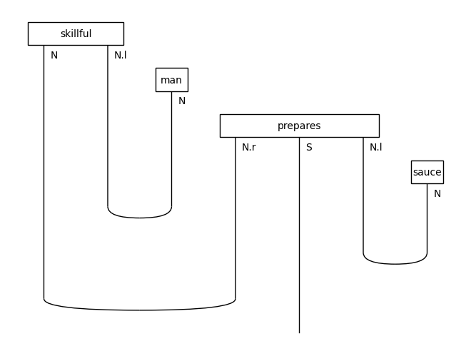
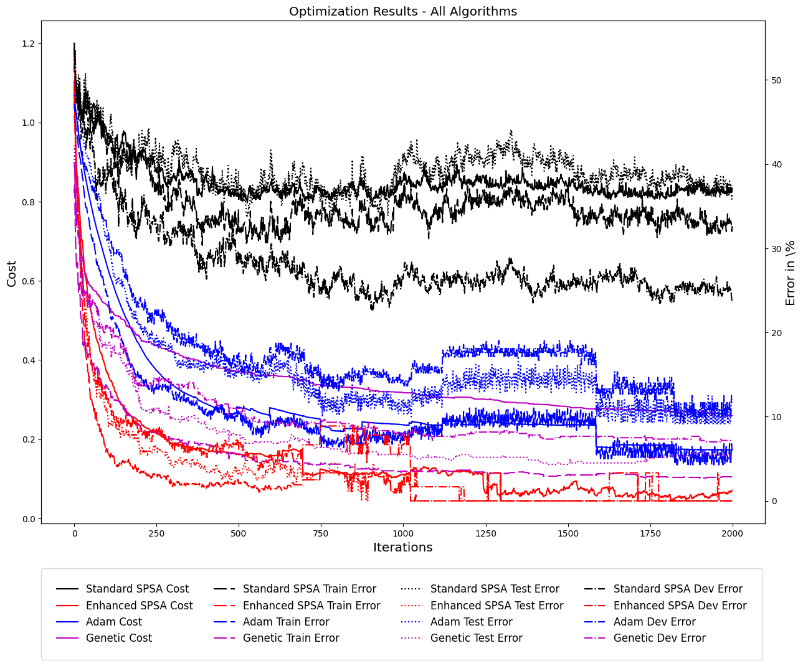

# Quantum Natural Language Processing (QNLP): Sentence Classification with Quantum Circuits

[](https://www.gnu.org/licenses/gpl-3.0)
[](https://www.python.org/downloads/release/python-390/)
[](https://nbviewer.org/github/iwang-1/FIRE-QML-WINNERS-QNLP/blob/main/code/mc_task.ipynb)
[](https://nbviewer.org/github/iwang-1/FIRE-QML-WINNERS-QNLP/blob/main/code/mc_task_simulation.ipynb)

A collaborative quantum machine learning research project exploring **quantum natural language processing** for sentence classification. Sentences are parsed into pregroup-grammar diagrams, compiled to parameterized quantum circuits, and trained to classify the 130-sentence food-vs-IT MC dataset. Building on Quantinuum's companion code for *QNLP in Practice* [1], the project implements two additional ansätze adapted from Sim et al.'s circuit catalogue [2] and evaluates three enhanced optimizers. In the committed runs, the enhanced optimizers beat an out-of-the-box standard-SPSA baseline (a common gradient-free optimizer, run here with its default gains) by **roughly 30 percentage points** of training and test accuracy.

**Tech:** Python · Jupyter · [DisCoPy](https://discopy.org/) · [Qiskit](https://www.ibm.com/quantum/qiskit) · [pytket](https://docs.quantinuum.com/tket/)

**Headline result** — from `mc_task_simulation.ipynb`, exact noiseless simulation averaged over 20 runs capped at 2,000 iterations (full details and plot in [Results](#results)):

| Metric | Improvement over the standard-SPSA baseline |
|---|---|
| Training accuracy | **~27–31 percentage points higher** |
| Test accuracy | **~32–37 percentage points higher** |

Calibration caveat: the standard-SPSA baseline runs with the optimizer's default gains (`a = c = 1.0`), while Enhanced SPSA receives gains calibrated by Spall's heuristic — so part of the measured gap reflects hyperparameter calibration rather than the algorithm changes alone.

## Repository Structure

```
├── assets/                        # Images for this README, exported from saved notebook outputs
├── code/
│   ├── mc_task.ipynb              # Full pipeline: shot-based simulation (Qiskit AerBackend) and IonQ QPU integration
│   └── mc_task_simulation.ipynb   # Exact classical simulation (DisCoPy + JAX): the optimizer comparison behind the headline results
└── datasets/
    ├── mc_train_data.txt          # Training split (70 sentences)
    ├── mc_dev_data.txt            # Development split (30 sentences)
    └── mc_test_data.txt           # Test split (30 sentences)
```

## Motivation

Traditional NLP struggles with ambiguous grammatical structures and long-range dependencies. QNLP offers a potential advantage by leveraging quantum-mechanical principles — superposition and entanglement — to represent and process linguistic information:

- **Compositional structure** — pregroup grammar's tensor structure maps naturally onto quantum circuits: word meanings become quantum states and grammatical composition becomes entangling operations, so the model's architecture mirrors the sentence's grammar by construction [1].
- **Encoding** — quantum states occupy a Hilbert space whose dimension grows exponentially with qubit count, offering a compact parameterization of high-dimensional feature spaces.
- **Expressibility** — parameterized quantum circuits form expressive function families whose expressibility can be quantified and compared across circuit designs (Sim et al. [2]) — the basis for the ansatz choices in this project.

**Objective:** build and evaluate a quantum ML model for binary sentence classification, investigating whether quantum circuits can usefully encode and process pregroup-grammar representations of sentences.

## Method

### Model pipeline

1. **Pregroup grammar parsing** — input sentences are parsed into diagrams representing their grammatical structure.
2. **Diagram transformation** — diagrams are simplified ("bending nouns around") to prepare for quantum encoding.
3. **Quantum encoding** — DisCoPy's `CircuitFunctor` maps the transformed diagrams to quantum circuits; each word is encoded as a parameterized circuit (IQP ansatz baseline) with learnable parameters.
4. **Measurement & classification** — measuring the final quantum state yields a probability distribution used for binary classification, trained against cross-entropy loss.



*Pregroup-grammar diagram for "skillful man prepares sauce" (drawn in `mc_task.ipynb`): cups contract matching noun types, leaving an open sentence wire `S` that becomes the circuit's output.*

### Additional ansätze

In addition to the standard IQP ansatz, we implemented two ansätze adapted from the circuit catalogue of Sim, Johnson & Aspuru-Guzik (2019) [2] — circuits 14 and 15, following lambeq's [`Sim14Ansatz`/`Sim15Ansatz`](https://github.com/CQCL/lambeq) implementations (see Khatri's thesis [3] for a systematic comparison of such ansätze on QNLP tasks):

| Ansatz | Design |
|---|---|
| **Sim14.1** | Each layer has two sublayers of *n* Ry rotations followed by a ring of *n* parameterized controlled-Rx (CRx) gates, with the ring orientation reversed in the second sublayer. |
| **Sim15.1** | Same layout as Sim14.1, with the parameterized CRx rings replaced by CNOT rings. |

Both circuit definitions live in `mc_task_simulation.ipynb`. Honest caveat: in the committed configuration (1 qubit per grammatical type), multi-qubit words use the IQP ansatz and single-qubit nouns use the ansätze's shared single-qubit form (Rx·Rz·Rx), so the multi-qubit Sim14.1/Sim15.1 circuits above are implemented but not exercised by the committed runs, and no per-ansatz comparison results are preserved in this repository. `mc_task.ipynb` uses the IQP ansatz throughout.

### Enhanced optimizers

To improve on standard SPSA (simultaneous perturbation stochastic approximation — a standard gradient-free optimizer [4][5]), we introduce three alternatives, each converging faster:

- **Enhanced SPSA** — SPSA with its gain constants calibrated by Spall's heuristic [5], the gradient estimate divided by the actual perturbation (2·c_k·Δ), and early stopping on cost convergence
- **ADAM** — a finite-difference ADAM optimizer [6] with early stopping
- **Genetic algorithm** — population-based parameter search

## Dataset

The MC ("meaning classification") dataset: 130 English sentences for binary classification (food vs. IT), split into 70 train / 30 dev / 30 test. The dataset was released with Lorenz et al., *QNLP in Practice* [1] ([Quantinuum/qnlp_lorenz_etal_2021_resources](https://github.com/Quantinuum/qnlp_lorenz_etal_2021_resources), GPL-3.0); the files in `datasets/` are unmodified copies from that release. Sentences follow three grammatical structures: `N_TV_N` (47 sentences), `N_TV_ADJ_N` (44), and `ADJ_N_TV_N` (39).

Preprocessing: tokenization → POS tagging → pregroup-grammar conversion → diagram transformation.

## Results

The headline results come from `mc_task_simulation.ipynb` — exact (noiseless) classical simulation of the circuits via DisCoPy's `Circuit.eval()`, JIT-compiled with **JAX** — averaged over **20 runs capped at 2,000 iterations** each. Enhanced SPSA and ADAM stop early once the cost converges, so their curves are nan-mean averages over the runs still active at each iteration. (`mc_task.ipynb` runs the same pipeline with shot-based simulation on Qiskit's **AerBackend** and includes IonQ QPU integration; it is committed with small demo run counts.)

All results use the IQP-ansatz configuration described in Method. One calibration caveat: the standard-SPSA baseline runs with the optimizer's default gains (`a = c = 1.0`), while Enhanced SPSA receives gains calibrated by Spall's heuristic — so part of the measured gap reflects hyperparameter calibration rather than the algorithm changes alone.

- Enhanced SPSA, ADAM, and the genetic algorithm all **converged faster than the standard-SPSA baseline**.
- The enhanced optimizers outperformed the standard-SPSA baseline on both training and test accuracy:

| Metric | Improvement over the standard-SPSA baseline |
|---|---|
| Training accuracy | **~27–31 percentage points higher** |
| Test accuracy | **~32–37 percentage points higher** |

(Computed from the mean final train/test error of each optimizer's 20 runs: standard SPSA 34%/41%, Enhanced SPSA 3%/4%, ADAM 7%/9%, genetic algorithm 6%/9%.)



*From `mc_task_simulation.ipynb`: standard SPSA (black) still hovers around 34% train / 41% test error after 2,000 iterations, while Enhanced SPSA, Adam, and the genetic algorithm bring mean final errors down to roughly 3–9%. Late stretches of the Enhanced SPSA and Adam curves average only the runs still active at that iteration.*

These numbers come from exact noiseless simulation — even shot noise is absent — so performance on real QPUs will differ due to noise and other hardware effects.

## Getting Started

No re-run is needed to review the experiments: both committed notebooks were executed top-to-bottom on Python 3.9 with the pinned dependencies from their first cells, so all training logs, diagrams, and result plots are preserved. The one exception is the final "IonQ QPU Code" section of `mc_task.ipynb`, which needs an IonQ API key and is left unexecuted.

To re-run the notebooks, use a Python 3.9 environment — the pinned 2021-era stack (`discopy==0.3.5`, `qiskit==0.27.0`, `pytket==0.11.0`, `pytket-qiskit==0.14.1`, `qiskit_ionq==0.1.4`, plus `jax==0.4.30` for the simulation notebook) predates Python 3.10 (qiskit 0.27 and pytket 0.11 ship wheels only up to 3.9), and modern `discopy` 1.x has an incompatible API:

```bash
# in a Python 3.9 environment
pip install jupyter
jupyter notebook code/mc_task.ipynb   # the first cell installs the pinned dependencies
```

The notebooks load the dataset splits from `datasets/` via relative paths, build the pregroup-grammar circuits, and train them against each optimizer: `mc_task.ipynb` at its small demo settings (`n_runs = 2`, `niter = 2`), and `mc_task_simulation.ipynb` with the full 20-runs-of-2,000-iterations experiment behind the Results section (roughly 30–60 minutes of CPU time, depending on hardware).

## Future Work

- **Hardware implementation** — evaluate on real quantum computers to assess the impact of noise.
- **Model scaling** — more complex sentences and larger datasets.
- **Novel architectures** — alternative circuit designs and ansätze for encoding linguistic information.
- **Error analysis** — detailed analysis of model errors to find limitations and improvements.
- **Hybrid models** — combining classical and quantum models for more robust, practical QNLP.

## Team

Completed by a four-person research team. Public repository contributors are
listed below; one teammate participated outside this commit history.

- **Evren Yucekus-Kissane** ([@EvrenKissane](https://github.com/EvrenKissane))
- **Anish Dhanrajani** ([@anish-dhanrajani](https://github.com/anish-dhanrajani))
- **Ivan Wang** ([@iwang-1](https://github.com/iwang-1)) — dataset integration and pipeline wiring, project documentation

See the commit history for the full contribution breakdown.

## Attribution & License

This project builds on the companion resources released with Lorenz et al., *QNLP in Practice* [1]: [Quantinuum/qnlp_lorenz_etal_2021_resources](https://github.com/Quantinuum/qnlp_lorenz_etal_2021_resources) (GPL-3.0). The dataset files are unmodified copies from that release, and the notebook pipeline (parsing, circuit encoding, and training loop) is derived from its reference implementation. The team's additions are the Sim14.1/Sim15.1 ansatz implementations, the three alternative optimizers (Enhanced SPSA, Adam, and a genetic algorithm), and the comparative evaluation of the optimizers.

Because this repository redistributes and derives from GPL-3.0 material, the derived content is subject to the terms of the [GNU GPL v3.0](https://www.gnu.org/licenses/gpl-3.0.html).

## References

1. Lorenz, R., Pearson, A., Meichanetzidis, K., Kartsaklis, D., & Coecke, B. (2023). [QNLP in Practice: Running Compositional Models of Meaning on a Quantum Computer](https://jair.org/index.php/jair/article/view/14329/26923). *Journal of Artificial Intelligence Research*. Companion code and data: [Quantinuum/qnlp_lorenz_etal_2021_resources](https://github.com/Quantinuum/qnlp_lorenz_etal_2021_resources).
2. Sim, S., Johnson, P. D., & Aspuru-Guzik, A. (2019). [Expressibility and entangling capability of parameterized quantum circuits for hybrid quantum-classical algorithms](https://arxiv.org/abs/1905.10876). *Advanced Quantum Technologies*, 2(12).
3. Khatri, N. — [Experimental Comparison of Ansätze for Quantum Natural Language Processing](https://www.cs.ox.ac.uk/people/aleks.kissinger/theses/khatri-thesis.pdf)
4. [SPSA — Qiskit Algorithms documentation](https://qiskit-community.github.io/qiskit-algorithms/stubs/qiskit_algorithms.optimizers.SPSA.html)
5. Spall, J. C. (1998). [Adaptive stochastic approximation by the simultaneous perturbation method](https://doi.org/10.1109/cdc.1998.761833). *Proceedings of the 37th IEEE Conference on Decision and Control.*
6. [qml.AdamOptimizer — PennyLane documentation](https://docs.pennylane.ai/en/stable/code/api/pennylane.AdamOptimizer.html)
